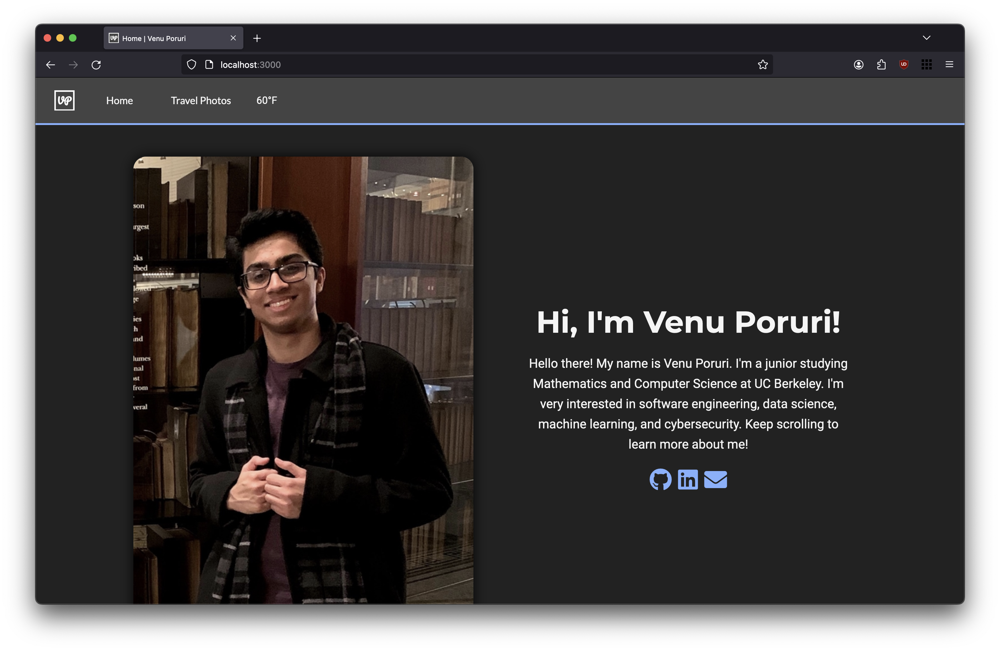

# My Website

This is the repository for my personal website. It is a work in progress and
will be updated frequently.



## Features

- **Introduction Section**: Includes a brief introduction about me and links to
  my social media profiles.
- **About Me Section**: Provides information about my interests and
  experiences.
- **Travel Photos Slideshow**: Displays a slideshow of my travel photos.
- **Contact Me Section**: Allows visitors to send me messages through a contact
  form.
- **Weather Information**: Shows the latest weather information in the
  navigation bar.

## Technologies Used

- HTML
- CSS
- JavaScript
- Express.js (for the server-side)
- Node.js
- Fetch API (for fetching data from external APIs)

## Usage

1. Clone the repository:

```bash
git clone https://github.com/vmporuri/personal-website.git
```

2. Install dependencies:

```bash
cd personal-website
npm install
```

3. Start the website.

```bash
node server.js
```

4. Visit `http://localhost:3000` in your web browser to view the website.
